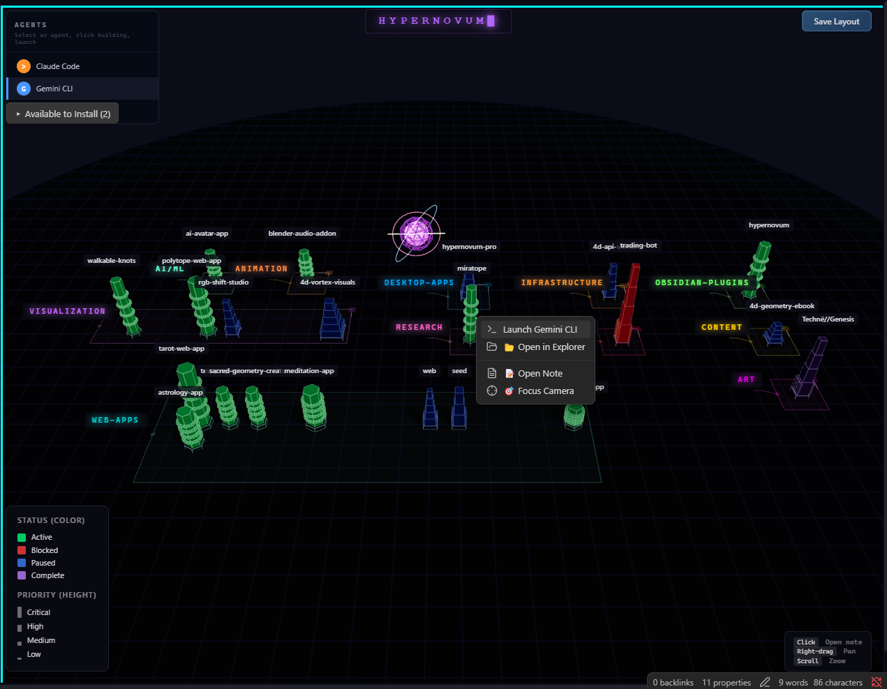
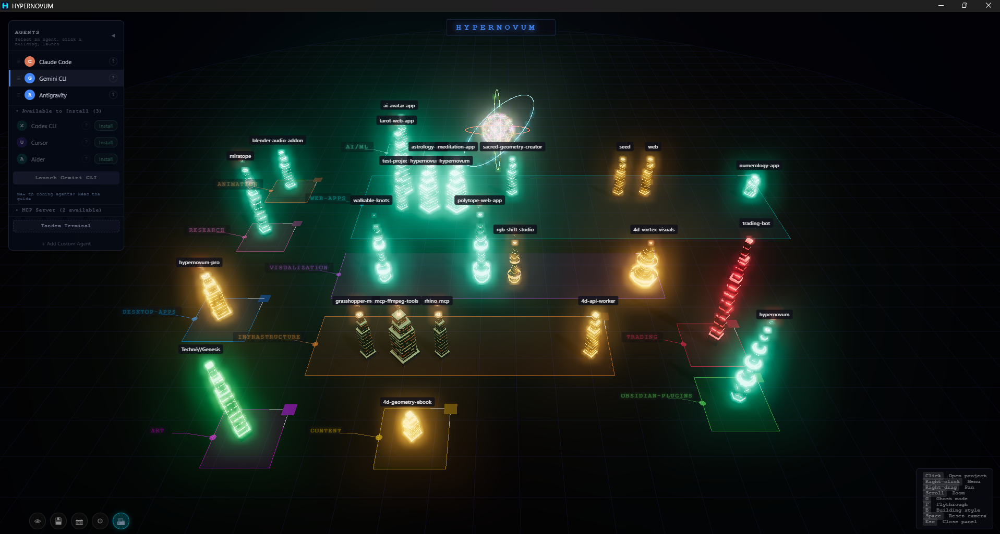

# Hypernovum — Agent Ops for Your Second Brain

A **3D IDE and agent-ops dashboard** for [Obsidian](https://obsidian.md), built on **Three.js**. Hypernovum turns your vault — your **second brain** — into a living cyberpunk code city: visualize projects and their backlinks in 3D, dispatch **AI coding agents** (Claude Code, GPT Codex, Antigravity CLI) with full vault context, post research quests for agents to resolve, and watch your entire fleet work in real time.

Each project note becomes a building. Status maps to color, priority to height, category to district, vault backlinks to glowing **Neural Link** arcs. A central **Neural Core** pulses with activity as you work, **Data Arteries** flow to buildings when files change, and every active agent orbits its building as a colored orb.



## What this plugin does on your machine

Hypernovum is desktop-only because the agent-ops half of it talks to your local
tools. Here is exactly what that means — nothing below happens silently, and you
choose on first run whether the agent layer is active at all.

**Hypernovum makes no network requests. No telemetry, no analytics, no remote calls
of any kind.** Everything it reads or writes is on your own machine.

| What | When | Why |
|------|------|-----|
| Runs read-only `git` commands (`branch`, `log`, `status`, `rev-list`) | On city build, in folders you link with `projectDir` | The Git activity layer: commit velocity, branch, dirty tree, merge conflicts. Turn off with **Settings → Git activity layer** |
| Runs `where` / `which` (no shell) | When the city view opens | Detects whether `claude` / `codex` / `agy` are installed, to grey out agents you don't have. Skipped entirely in vault mode |
| Opens a terminal and runs your chosen agent CLI | Only when you click **Launch agent** | The point of the agent launcher |
| Opens your file manager | Only when you click **Open folder** | — |
| Reads files outside the vault | Project folders you link (`package.json`, `.git`), plus `~/.claude/skills/` | Dependency detection and the abilities roster |
| Writes files outside the vault | `.hypernovum/SETUP.md` + `.hypernovum/.gitignore` in a project folder, only when you launch an agent there | Hands the agent its project context |
| Writes inside the vault | `AGENTS.md`, `.hypernovum/heartbeat.js`, briefings, snapshots — each on an explicit action | — |
| Reads the clipboard | Never. Only writes, when you click a copy button | — |

**Vault mode** (Settings, or the command palette) turns the entire agent layer off:
no process execution, no reads outside the vault. The city, lenses, filters, and
backlink graph all still work.

## Features

### City Visualization
- **Bin-packed layout** with category districts, block outlines, and drag handles for rearranging
- **Procedural architecture** — each category gets a unique silhouette (helix towers, data shards, ziggurats, quant blades, hex hives, memory cores)
- **Cyberpunk shader system** with procedural windows, decay dithering, and bloom post-processing
- **Smart labels** with CSS2D rendering and leader lines
- **Hover tooltips** showing status, priority, health, and tech stack

### Second Brain & Agent Ops
- **Prepare vault for AI agents** — one click writes a marker-fenced `AGENTS.md` at the vault root: project schema, live inventory, quest board, skills roster, and heartbeat protocol, so any CLI agent instantly understands your second brain
- **Quest board**: a `questions:` list in project frontmatter renders as a floating gold quest marker over the building, shows in the inspector and tooltip, and is published to agents via AGENTS.md — resolving a quest (move it to `answered:`) fires an emerald shockwave at the building
- **Abilities roster**: agent skills (`SKILL.md` files in vault or `~/.claude/skills/`) listed in the agents panel — click to copy an invocation
- **Neural Links**: toggle vault backlinks between projects as pulsing violet knowledge arcs — your knowledge graph as city infrastructure
- **Agent fleet presence**: every v2 heartbeat session gets its own state-colored orb with an identity tooltip (name/state/action/file); two agents touching the same file surface a deterministic conflict ring and inspector row
- **Daily briefing**: one command writes a digest note — status counts, blocked/stale attention list, quest board, git heat

### Interactions
- **Single-click** a building to **select + focus** it — the city dims around your selection and connected neighbors stay lit; the camera doesn't move. **Double-click** opens the note. *(This changed in 0.4 — click no longer opens; a one-time hint appears.)*
- **Esc** or a click on empty ground clears the selection; **Move building** is a right-click menu item.
- **Right-click** menu: Launch agent · Inspect · Move building · **Trace impact** · Open folder · Open terminal · Copy path · Add quest · Open note · Focus camera.
- **Search and filters** narrow the city by title, status, priority, category, path, or stack — filtered-out buildings hide in place (no re-shuffling).
- **Scan lenses** (dropdown): status, **Needs Attention** (triage), Git activity, memory-ready, task-progress ramp, recency heatmap, tech-stack — with an adaptive legend. A **⚠ badge** jumps to the attention lens.
- **Saved lens presets**: three defaults (Active Work / Needs Attention / Agents) plus "Save current view".
- **EDGES chips** toggle the typed project graph: Backlinks · Deps · Blocked · Agents.
- **Project inspector**: git signals + recent commits, warnings, dependency sections (Depends on / Used by / Blocked by / Blocks), agent activity, and a last-session digest. **City overview** (nothing selected) shows district analytics, a fleet summary, an attention list, and a recent-activity feed.
- **Building style** (settings): Classic silhouettes or **Parametric** data-true towers (opt-in, applies live).
- **Snapshot**: one click saves a clean cinematic PNG (title card, no HUD) into your vault.
- **Drag handles** rearrange category blocks; **scroll** to zoom, **right-drag** to pan; **keyboard** cycles blocked/stale projects + resets camera.

### Neural Core & Data Arteries
- Central **geodesic wireframe sphere** with RGB chromatic split and rotating rings
- **Data Arteries** — animated tube geometry flowing from core to buildings on file changes
- **City states**: IDLE (cyan) / STREAMING (cyan fast) / BULK_UPDATE (gold)

### Claude Code Integration
- **Activity Monitor** polls `.hypernovum/agents/` (v2 per-session snapshots) plus the legacy `.hypernovum-status.json` for real-time agent status
- **Persistent streaming artery** while Claude is actively working on a project
- **Activity indicator overlay** shows current project and action
- **Terminal Launcher** for launching Claude Code, GPT Codex, Antigravity CLI, or a custom agent command
- **Agent context handoff** writes `.hypernovum/SETUP.md` with project metadata, Git signals, and memory context pointers before launch
- **Heartbeat script** installed into your vault at `.hypernovum/heartbeat.js` by the **Install agent heartbeat hooks** command, which also prints ready-to-paste hook JSON with every path already resolved

### Git & Memory Signals
- **Read-only Git activity layer** shows recent commit velocity, branch, working-tree state, stale projects, and merge conflict signals
- **Memory-ready filter** finds projects that already have `.hypernovum/MEMORY_CONTEXT.md`
- **Funding metadata** is included for users who want to support the free plugin

### HUD
- **HYPERNOVUM** neon title with flashing block cursor at top center
- **Adaptive SCAN-MODE legend** that re-renders per visual layer (status chips, gradient ramps, live stack roster)
- **Controls hint** overlay with all mouse and keyboard shortcuts
- **Save Layout** and **Snapshot** buttons

## Platform Support

| Platform | Terminal Emulators | Notes |
|----------|-------------------|-------|
| **Windows** | Windows Terminal, cmd.exe | Tries `wt` first, falls back to `cmd` |
| **macOS** | iTerm2, Terminal.app | Tries iTerm2 first (if running), falls back to Terminal.app |
| **Linux** | gnome-terminal, konsole, xfce4-terminal, xterm | Tries each in order until one succeeds |

All features — Neural Core, Data Arteries, Claude Code integration, context menus — work identically on every platform. The only difference is which terminal emulator opens.

## Frontmatter Schema

Projects are detected by frontmatter tag `project` or field `type: project`. See [SCHEMA.md](SCHEMA.md) for the full field reference.

```yaml
---
tags: [project]
title: My Project
status: active
priority: high
category: web-apps
stack: [TypeScript, React, Vite]
questions:            # optional research quests for AI agents
  - "Which vector DB fits this workload?"
projectDir: C:\Users\me\projects\my-project   # Windows
# projectDir: /Users/me/projects/my-project   # macOS
# projectDir: /home/me/projects/my-project    # Linux
---
```

## AI Integration

Hypernovum has **no built-in AI**. External AI tools (Claude Code, etc.) read `SCHEMA.md` to learn the frontmatter format, scan your project directories, and write frontmatter to vault notes. Hypernovum renders the result.

**Prepare vault for AI agents** (command palette, settings, or the agents panel) writes an `AGENTS.md` at the vault root containing the frontmatter schema, a live inventory of your projects, and instructions for making agent activity visible in the city — so any CLI agent launched in the vault immediately understands your second brain. Safe to re-run: only the marked Hypernovum section is regenerated; the rest of an existing `AGENTS.md` is preserved.

### Agent presence (heartbeat v2)

Run the command palette action **"Install agent heartbeat hooks"**. It installs the
heartbeat script into your vault at `.hypernovum/heartbeat.js` and shows you two
things with every path already filled in for your machine: a one-line command to
test with, and the JSON to merge into `~/.claude/settings.json`. (Hypernovum shows
that JSON for you to copy — it never edits your global agent config itself.)

Once wired up, each agent session appears as its own orb. From a hook, use `--hook`
— the script then reads `session_id`, `tool_name`, and `cwd` from the hook's stdin
JSON, which is the only place Claude Code provides them (there is no
`$CLAUDE_SESSION_ID` environment variable):

```bash
# from a Claude Code hook — nothing to interpolate
node "<vault>/.hypernovum/heartbeat.js" --vault="<vault>" --hook \
  --name="Claude Code" --agent-type=claude

# by hand or from your own wrapper: reuse one --id for the whole session
node "<vault>/.hypernovum/heartbeat.js" --vault="<vault>" --id="my-session" \
  --name="Claude Code" --agent-type=claude --project="my-project" \
  --state=editing --tool=Edit --file=src/x.ts

# on finish
node "<vault>/.hypernovum/heartbeat.js" --vault="<vault>" --id="my-session" --stop
```

**Heartbeat v2** gives every session its own snapshot file
(`.hypernovum/agents/<sessionId>.json`), so any number of agents run concurrently
without clobbering each other. The orb is colored by `--state` (working / waiting /
blocked / complete / stale), carries an identity tooltip, and — when two sessions
send overlapping `--file` values on one project — surfaces a deterministic conflict
in the city. Any agent or wrapper that can run a command can ping it; Claude Code
hooks are just the most convenient path.

> The script's source of truth is `scripts/heartbeat.js` in this repository; the
> plugin carries an embedded copy and writes it into your vault, so an installed
> plugin never depends on having the repo checked out.

> **Legacy:** the older single-file `.hypernovum-status.json` is still read for one
> release, so existing hooks keep working (as an anonymous agent). v2 adds
> identity, lifecycle state, and conflict detection.

## Development

```bash
npm install
npm run dev        # watch mode (also regenerates the embedded heartbeat source)
npm run build      # production build
npm run typecheck  # tsc across core + plugin (esbuild does NOT typecheck)
npm test           # vitest
```

Releases are cut from the **root `manifest.json`** — bump `version` there, then run
`node scripts/check-versions.mjs --fix` to mirror it into the plugin manifest, both
`package.json` files, and `versions.json`. Tag with the bare version (`0.4.0`, no
`v` prefix) and CI builds and attaches the release assets.

Built with [Three.js](https://threejs.org/), [Zustand](https://github.com/pmndrs/zustand), and the [Obsidian Plugin API](https://docs.obsidian.md/).

## Hypernovum Pro

This Obsidian plugin remains free and open source. For a standalone desktop experience beyond Obsidian — featuring full Engram Persistent Agent Memory, AI agent management, MCP server integration, Tandem Terminal, broader project scanning, and more — check out [Hypernovum Pro](https://studio.pardesco.com/hypernovum).




## License

[AGPL-3.0](LICENSE) — Free to use, modify, and distribute. Any modified version that is deployed must also be open-sourced under AGPL-3.0.
